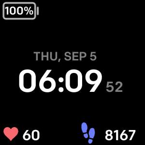
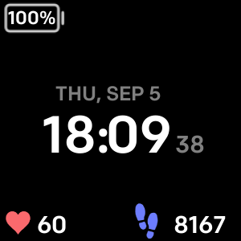
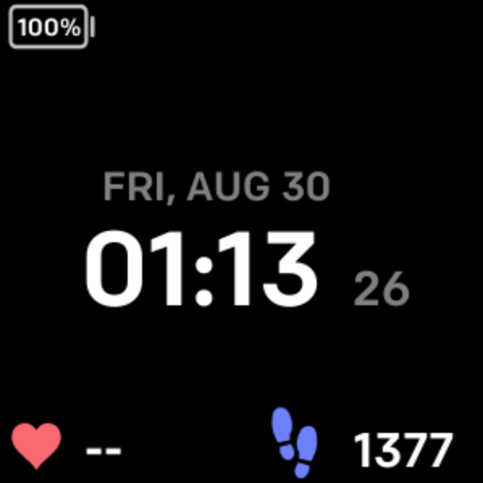

# Fitbit-Watchface
Feb 7: Work in progress FitBit watch face to show battery level and weather in addition to date, time, steps, and heart rate.

################################################################################

Aug 30: Completed FitBit watchface with battery level, date, time, and heart rate.

        -Heart rate is shown as "--" when not on wrist.
        -Tapping the screen to cycles through steps, distance, stairs, calories, and active minutes.
        -Time is offered in both 24 and 12 hour formats.
        -All activities are updated by clock granularity, which is set to every second.
        -Activity is still tracked and updated while screen is off.

################################################################################

Aug 31: Updated image sizes inside resource folder to address flickering/not displaying on watch face.

################################################################################

Sep 03: Updated activity function calls to update on swap to respective activity instead of every second.
        Will help reduce battery consumption of watch.
        
################################################################################

Sep 05: Update

        -Updated activity function call, battery function call, and clock function call to only occur
             when display is on. This will help reduce battery consumption of watch.
        -Included a back feature for switching between activities. Clicking left side of screen
             will show previous activity while clicking right side of screen will show next activity.
        -Updated images to show more examples of watch as well as previous/next activity feature.

################################################################################

November 10, 2020 Update (4.2 Version):

        -Updated to lastest Versa SDK (4.2).
        -Changed Active Minutes to show Active Zone Minutes total.
        -Uploaded to Fitbit Gallery App Manager for download to in phone app clockface page instead of
                as seperate developer app.

################################################################################

December 08, 2020 Update (Fitbit Gallery Version):

        -Updated active minutes to active zone minutes. Changed icon and text to accurately represent.
        -Changed folder name to match watchface name.

################################################################################

