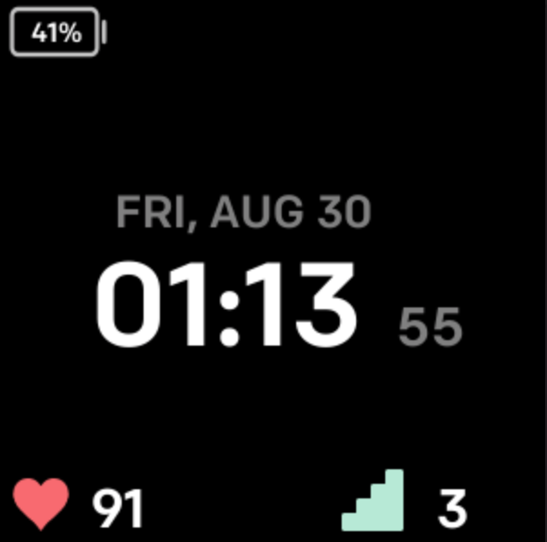

# Fitbit-Watchface
Feb 7: Work in progress FitBit watch face to show battery level and weather in addition to date, time, steps, and heart rate.

################################################################################

Aug 30: Completed FitBit watchface with battery level, date, time, and heart rate.

        -Heart rate is shown as "--" when not on wrist.
        -Tapping the screen to cycles through steps, distance, stairs, calories, and active minutes.
        -Time is offered in both 24 and 12 hour formats.
        -All activities are updated by clock granularity, which is set to every second.
        -Activity is still tracked and updated while screen is off.

################################################################################

Aug 31: Updated image sizes inside resource folder to address flickering/not displaying on watch face.

################################################################################

